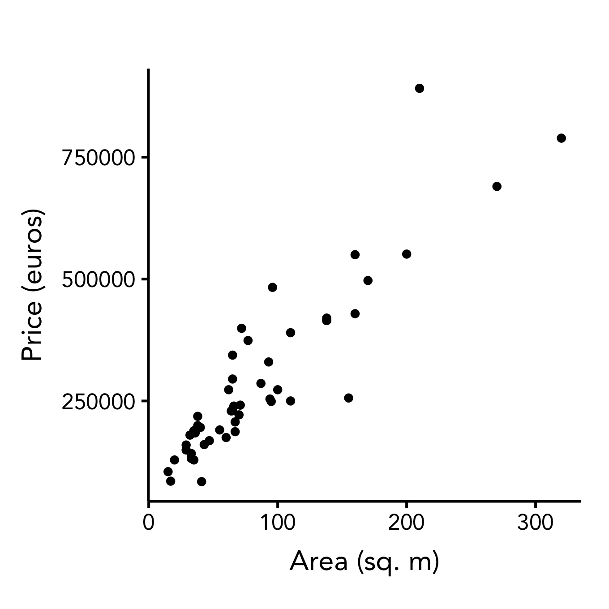

# Linear Regression

Linear regression is one of the most well-known and most commonly used machine learning algorithms.
It allows us to learn the linear dependency between the input variables $x_1, \dots, x_n$ and the output variable $y$.
Then we can use the trained model to predict the previously unseen values of y.

## Simple Example: Predicting the Price of a House Based on its Area

We start with the simple example of estimating the price of a house that is put on sale.
In practice, many factors can influence the price: area, number of rooms, floor, distance from the city center, neighbourhood, distance from the metro, market economy, etc.
But in this simple example, we will be only considering one factor: the area of a house.
We start with a trivial assumption: houses with small area are cheaper than houses with large area.
Our goal is to find a mathematical expression that would allow us to estimate as well as we can the price of the house based only on its area.

### Collecting the Data

First, we go to [Leboncoin](https://www.leboncoin.fr/) and search for houses in Lille.
We select top 50 houses into our datases, recording the value and price of each house.
You can see them visualized in the picture below.

### Estimating the Price

Intuitively, by looking at the data, we can understand what would be the good estimate of a house price.

