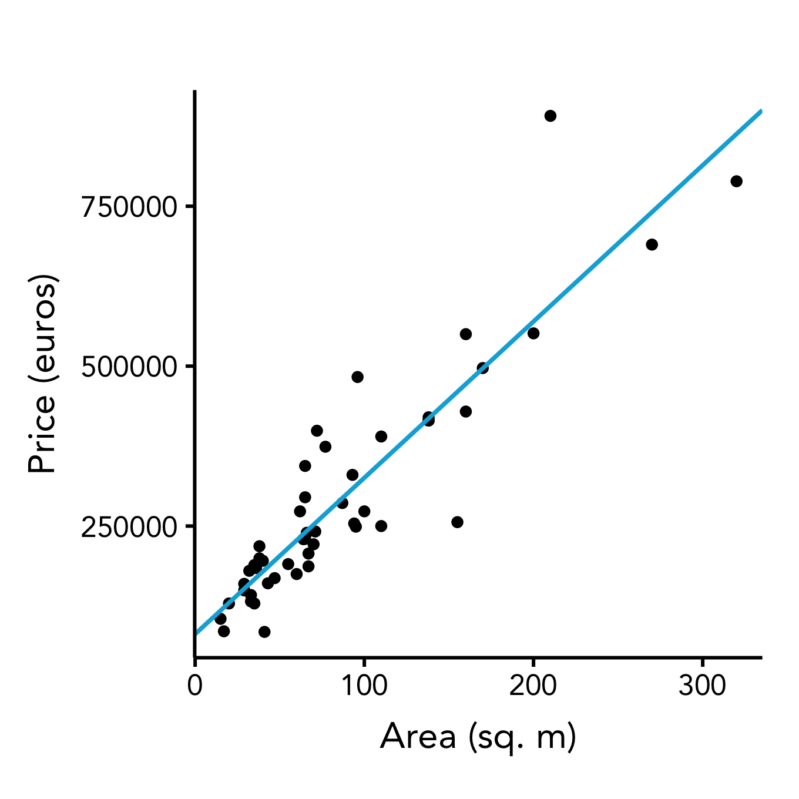
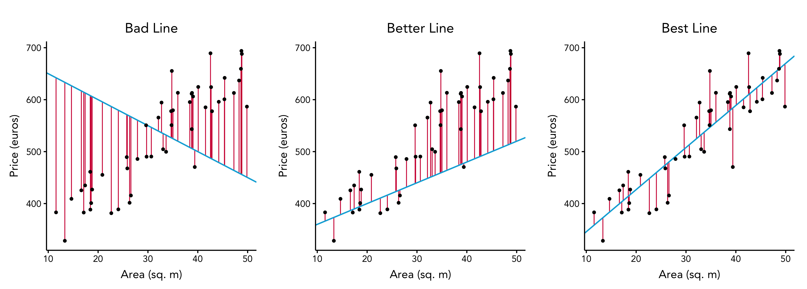

# Linear Regression

Linear regression is one of the most well-known and most commonly used machine learning algorithms.
It allows us to learn the linear dependency between the input variables $x_1, \dots, x_n$ and the output variable $y$.
Then we can use the trained model to predict the previously unseen values of y.

## Simple Example: Predicting the Price of a House Based on its Area

We start with the simple example of estimating the price of a house that is put on sale.
In practice, many factors can influence the price: area, number of rooms, floor, distance from the city center, neighbourhood, distance from the metro, market economy, etc.
But in this simple example, we will be only considering one factor: the area of a house.
We start with a trivial assumption: houses with small area are cheaper than houses with large area.
Our goal is to find a mathematical expression that would allow us to estimate as well as we can the price of the house based only on its area.

### Collecting the Data

First, we go to [Leboncoin](https://www.leboncoin.fr/) and search for houses in Lille.
We select top 50 houses into our datases, recording the value and price of each house.
You can see them visualized in the picture below.

### Estimating the Price

When we need to estimate the price for a new house, the good strategy would be to look at the houses with the similar area.
Intuitively, based on the data that we have collected, we can understand that the green points are better price estimations for the house with 55 sq.m than the red points.

We can also see that the data follows a certain linear pattern.
If we draw the line through those points, it will give us the best estimation of a house price based on its area.

Such line can be defined with a line equation: $y=kx+b$.
It allows us to estimate the output $y$ (in our case, the price) based on input value $x$, in 

* Parameter $k$ is called the _"slope"_, it defines the angle at which the line is rotated.
* Parameter $b$ is the intercept, it defines the distance from origin $(0,0)$ to the point $(0,y_0)$ at which the line intersects the y-axis (in other words, _"how high is the line raised from origin?"_).

By finding the optimal values of those two parameters, we find the best line.

### Which Line is the Best?

To understand what is the best line (or the best price estimation), we need to define a metric that will allow us to measure the goodness of fit for every given line.
There are many ways to do that.
One such metric is called the _mean squared error_ (MSE).

For every house in our dataset, we calculate the _estimation error_ --- the difference between the price estimated by the line and the real price.

The good line would have as small errors as possible.
You can see this in the image below, which demonstrates three line estimates of the dataset: the bad line which makes large errors, the better line which makes smaller errors, and the best line which makes as little errors as possible.

For a given set of parameters $k$ and $b$, the price estimation is calculated as

$$y\hat = kx + b$$

For the dataset of $m$ houses, the MSE is calculated in the followimng way:

$$MSE = \frac{1}{m}\sum_{i=1}^m (y\hat - y)^2$$

### Linear Regression: Finding the Best Line to Fit the Data