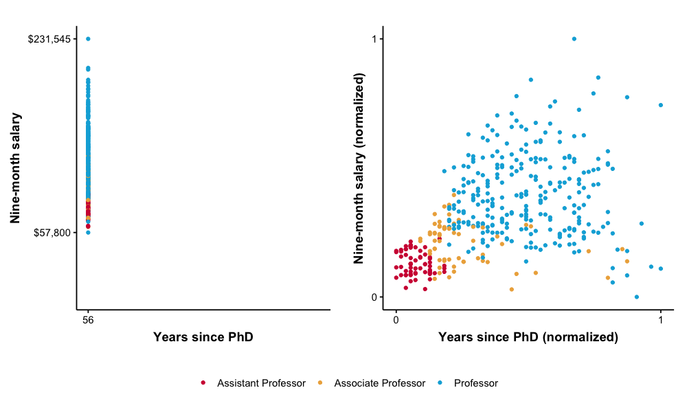

# Using Logistic Regression

Write something here

## Table of Contents  
- [Preprocessing the data](#Preprocessing-the-data)  
- [Training the machine learning model](#Training-the-machine-learning-model)
- [About normalization](#About-normalization)
- [Measuring the accuracy and other metrics of the model](#Measuring-the-accuracy-and-other-metrics-of-the-model)
- [Workflow summary](#Workflow-summary)

## [Preprocessing the data](#Preprocessing-the-data)

In Pharo, we have a library for loading several dataset directly into Pharo as DataFrame objects. [Pharo Datasets](https://github.com/pharo-ai/Datasets). It contains the well-know examples like the [iris dataset](https://scikit-learn.org/stable/auto_examples/datasets/plot_iris_dataset.html) and other ones.
Here we will use a dataset from the [National Institute of Diabetes and Digestive and Kidney Diseases](https://www.kaggle.com/uciml/pima-indians-diabetes-database) for predicting if a patient has or not diabetes.

First we need to install the library using the [Metacello script](https://github.com/pharo-ai/Datasets) available in the README. The method `loadXXX` will return a [DataFrame object](https://github.com/PolyMathOrg/DataFrame).

[Pharo DataFrame](https://github.com/PolyMathOrg/DataFrame) can be seen as the Pharo equivalent of [Python Pandas](https://pandas.pydata.org/).

```st
"Loading the dataset"
diabetesPima := AIDatasets loadDiabetesPima.
```

Now, for training our model, we need at least two partitions of the data set: one for training and the other for measuring the accurancy of the model. Also in Pharo, we have a small library to help you with that task! [Random Partitioner](https://github.com/pharo-ai/random-partitioner). First random shuffle the data and then partitions the data to the given proportions. This is included by default when you load the [Pharo Datasets](https://github.com/pharo-ai/Datasets) or [Pharo DataFrame](https://github.com/PolyMathOrg/DataFrame). So, you do not need to install it again. We will partiton our data into two sets: training and test with a proportion of 75%-25%.

```st
"Dividing into test and training"
partitioner := AIRandomPartitioner new.
subsets := partitioner split: diabetesPima withProportions: #(0.75 0.25).
diabetesPimaTrainDF := subsets first.
diabetesPimaTestDF := subsets second.
```

As a next step, we can separate the features between X and Y. That means: into the independent variables `X` and the dependent variable `Y`. As we have the data loaded in a DataFrame object, we can select the desire columns.

If we inspect the variable `diabetesPima columnNames` we will see: `an OrderedCollection('Pregnancies' 'Glucose' 'BloodPressure' 'SkinThickness' 'Insulin' 'BMI' 'DiabetesPedigreeFunction' 'Age' 'Outcome')`. Where `Outcome` is the dependent variable and all the rest are the independent ones.

The method `DataFrame>>columns:` will return a new DataFrame with the specify columns.

```st
"Separating between X and Y"
diabetesPimaTrainDF columnNames. "an OrderedCollection('Pregnancies' 'Glucose' 'BloodPressure' 'SkinThickness' 'Insulin' 'BMI' 'DiabetesPedigreeFunction' 'Age' 'Outcome')"

xTrain := diabetesPimaTrainDF columns: #('Pregnancies' 'Glucose' 'BloodPressure' 'SkinThickness' 'Insulin' 'BMI' 'DiabetesPedigreeFunction' 'Age').
yTrain := diabetesPimaTrainDF column: 'Outcome'.

xTest := diabetesPimaTestDF columns: #('Pregnancies' 'Glucose' 'BloodPressure' 'SkinThickness' 'Insulin' 'BMI' 'DiabetesPedigreeFunction' 'Age').
yTest := diabetesPimaTestDF column: 'Outcome'.
```

Now we have everything that we need to start training our machine learning model!

## [Training the machine learning model](#Training-the-machine-learning-model)

The API for both the logistic and linear regression is the same. You can load the logistic regression in the [pharo-ai linear-models](https://github.com/pharo-ai/linear-models) repository.

The linear models (logistic and linear regression) accept only a `SequenceableCollection` (For now, we are working on making it compatible with DataFrame). We need to convert the DataFrame to an array. Which is quite easy, we only send the message `asArray` or `asArrayOfRows`.

```st
"Converting the DataFrame into an array of arrays For using it in the linar model.
For now, the linear model does not work on a DataFrame."
xTrain := xTrain asArray.
yTrain := yTrain asArray.
xTest := xTest asArray.
yTest := yTest asArray.
```

We are set. Now we proceed to train the model.

```st
"Training the logistic regression model"
logisticRegression := AILogisticRegression
	learningRate: 0.1
	maxIterations: 5000.

logisticRegression fitX: xTrain y: yTrain.
yPredicted := logisticRegression predict: xTest.
```

## [About normalization](#About-normalization)

If you try to run all the code that we wrote until now, you most likely saw an exception with the message: `The model is starting to diverge. Try setting up a smaller learning rate or normalizing your data.`. It is normal! Usually, a model starts to diverge when the data is not normalize or the learning rate is too high. In this case is because the data is not normalized.

### What is normalization?

In statistics and machine learning, normalization is the process which transforms multiple columns of a dataset to make them numerically consistent with each other (e.g. be on the same scale) but in the same time preserve the valuable information stored in these columns.

For example, we have a table that the Salaries that a person earns according to some criteria. The values of variable Years since PhD are in the range of `[1 .. 56]` and the salaries `[57,800 .. 231,545]`. If we plot the two variables we see:



So, the big difference between the range of the values can affect out model.

If you want to read more about normalization Oleks has a [nice blog post about it](https://blog.oleks.fr/normalization).
>Part of the test of this normalization part and the image were extracted from that post.

For normalizing our data, DataFrame has a simple API: we just call the `DataFrame >> normalized` method that returns a new DataFrame that has been normalized. This method uses the default normalizer that is the min max normalizer. If you want to use another one you can use the method `DataFrame >> normalized: aNormalizerClass` instead.

So, we just execute this part **before** partitioning the data.

```st
"Normalizing the data frames"
normalizedDF := diabetesPima normalized.
```

Pay attention, in the partitioning part we need to use the `normalizedDF` variable instead of the `diabetesPima`.

```st
subsets := partitioner split: normalizedDF withProportions: #(0.75 0.25).
```

Now, if we train the model with the normalized data we will see that everything runs smoothly! Also, as all the data is in the range of [0, 1] we can use a bigger learning rate. We saw that with a learning rate of `3` the model converges faster and has the same accuracy.

```st
"Training the logistic regression model"
logisticRegression := AILogisticRegression
	learningRate: 3
	maxIterations: 5000.

logisticRegression fitX: xTrain y: yTrain.
yPredicted := logisticRegression predict: xTest.
```

## [Measuring the accuracy and other metrics of the model](#Measuring-the-accuracy-and-other-metrics-of-the-model)

We have our model trained, we have the predictions of our model. What do we do now?
Well, we can use statistical metrics to measure our model!

Yes, in Pharo we also have a library for that: [Machine learning metrics](https://github.com/pharo-ai/metrics).
As usual, just install the library running the Metacello script from the README.

```st
"Computing the accuracy of the logistic regression model"
metric := AIAccuracyScore new.
accuracy "0.7916666666666666" := (metric computeForActual: yTest predicted: yPredicted) asFloat.
```

Our model has a accuracy of 79%

## [Workflow summary](#Workflow-summary)

You can run the following script in a Pharo image to get all the result that we discussed above.
Don't forget to install the libraries!

The summary of all the workflow that we have done is:

```st
"Loading the dataset"
diabetesPima := AIDatasets loadDiabetesPima.


"Normalizing the data frames"
normalizedDF := diabetesPima normalized.


"Dividing into test and training"
partitioner := AIRandomPartitioner new.
subsets := partitioner split: normalizedDF withProportions: #(0.75 0.25).
diabetesPimaTrainDF := subsets first.
diabetesPimaTestDF := subsets second.


"Separating between X and Y"
diabetesPimaTrainDF columnNames. "an OrderedCollection('Pregnancies' 'Glucose' 'BloodPressure' 'SkinThickness' 'Insulin' 'BMI' 'DiabetesPedigreeFunction' 'Age' 'Outcome')"

xTrain := diabetesPimaTrainDF columns: #('Pregnancies' 'Glucose' 'BloodPressure' 'SkinThickness' 'Insulin' 'BMI' 'DiabetesPedigreeFunction' 'Age').
yTrain := diabetesPimaTrainDF column: 'Outcome'.

xTest := diabetesPimaTestDF columns: #('Pregnancies' 'Glucose' 'BloodPressure' 'SkinThickness' 'Insulin' 'BMI' 'DiabetesPedigreeFunction' 'Age').
yTest := diabetesPimaTestDF column: 'Outcome'.


"Converting the DataFrame into an array of arrays For using it in the linar model.
For now, the linear model does not work on a DataFrame."
xTrain := xTrain asArray.
yTrain := yTrain asArray.
xTest := xTest asArray.
yTest := yTest asArray.


"Training the logistic regression model"
logisticRegression := AILogisticRegression
	learningRate: 3
	maxIterations: 5000.

logisticRegression f~itX: xTrain y: yTrain.
yPredicted := logisticRegression predict: xTest.


"Computing the accuracy of the logistic regression model"
metric := AIAccuracyScore new.
accuracy "0.7916666666666666" := (metric computeForActual: yTest predicted: yPredicted) asFloat.
```
